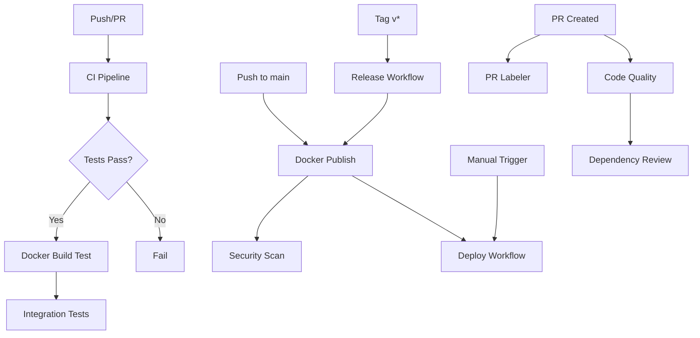

# CI/CD Pipeline Documentation

This document describes the GitHub Actions CI/CD pipeline for the Release Checklist Tool.

## Overview

The pipeline consists of multiple workflows that handle continuous integration, deployment, code quality, and release management.

## Workflows

### 1. CI Pipeline (`ci.yml`)

**Triggers:**
- Push to `main` or `develop` branches
- Pull requests to `main` or `develop` branches

**Jobs:**

#### Backend Tests
- Sets up PostgreSQL test database
- Installs Bun runtime
- Runs database migrations
- Executes backend tests

#### Frontend Tests
- Sets up Node.js environment
- Runs ESLint linter
- Executes frontend tests with Vitest
- Verifies production build

#### Backend Build
- Verifies backend can build successfully
- Validates production dependencies

#### Docker Build
- Tests Docker image builds for both frontend and backend
- Uses BuildKit cache for faster builds
- Does not push images (test only)

#### Integration Tests
- Spins up complete stack using Docker Compose
- Verifies backend health endpoint
- Tests frontend accessibility
- Shows logs on failure

**Required Secrets:** None (uses default GITHUB_TOKEN)

---

### 2. Docker Build and Publish (`docker-publish.yml`)

**Triggers:**
- Push to `main` branch
- Version tags (e.g., `v1.0.0`)
- Release published

**Jobs:**

#### Build and Push
- Builds multi-architecture images (amd64, arm64)
- Pushes to GitHub Container Registry (ghcr.io)
- Tags images with:
  - Branch name
  - Semantic version
  - SHA
  - `latest` (for main branch)
- Generates build provenance attestations

#### Security Scan
- Scans images with Trivy
- Uploads results to GitHub Security
- Checks for vulnerabilities in both frontend and backend images

**Required Secrets:**
- `GITHUB_TOKEN` (automatically provided)

**Permissions:**
- `contents: read`
- `packages: write`
- `security-events: write`

---

### 3. Deployment (`deploy.yml`)

**Triggers:**
- Manual workflow dispatch

**Inputs:**
- `environment`: Choose between production/staging
- `tag`: Docker image tag to deploy

**Jobs:**

#### Deploy
- Deploys specified image version to chosen environment
- Provides deployment context and timestamp
- Creates deployment summary
- Template includes SSH deployment example (commented out)

#### Rollback
- Runs only on deployment failure
- Provides rollback instructions

**Required Secrets (for SSH deployment):**
- `SSH_PRIVATE_KEY`: SSH key for deployment server
- `DEPLOY_HOST`: Deployment server hostname
- `DEPLOY_USER`: SSH user for deployment

**Note:** The SSH deployment commands are commented out as a template. Customize based on your deployment target.

---

### 4. Code Quality (`code-quality.yml`)

**Triggers:**
- Push to `main` or `develop` branches
- Pull requests to `main` or `develop` branches

**Jobs:**

#### ESLint Analysis
- Runs ESLint on frontend code
- Reports linting issues

#### CodeQL Analysis
- Performs static security analysis
- Scans JavaScript and TypeScript code
- Uses security-extended queries
- Reports to GitHub Security

#### Dependency Review
- Reviews dependency changes in PRs
- Fails on moderate+ severity vulnerabilities
- Blocks GPL-3.0 and AGPL-3.0 licenses

#### Code Coverage
- Runs tests with coverage reporting
- Uploads coverage to Codecov
- Generates coverage summary

**Required Secrets:**
- `CODECOV_TOKEN` (optional, for Codecov upload)

**Permissions:**
- `contents: read`
- `security-events: write`
- `actions: read`

---

### 5. PR Labeler (`pr-labeler.yml`)

**Triggers:**
- Pull request opened, synchronized, or reopened

**Jobs:**

#### Auto Label PR
- Labels PRs based on changed files
- Adds size labels (xs, s, m, l, xl)
- Warns on extra-large PRs

**Configuration:** See `.github/labeler.yml`

**Permissions:**
- `pull-requests: write`

---

### 6. Release (`release.yml`)

**Triggers:**
- Push of version tags (e.g., `v1.0.0`)

**Jobs:**

#### Create Release
- Generates changelog from PRs
- Creates GitHub release
- Includes Docker pull commands
- Marks pre-releases (versions with `-`)

**Configuration:** See `.github/release-notes-config.json`

**Permissions:**
- `contents: write`
- `packages: write`

---

### 7. Dependabot (`dependabot.yml`)

**Configuration File:** `.github/dependabot.yml`

**Monitors:**
- Backend npm packages
- Frontend npm packages
- GitHub Actions versions
- Docker base images

**Schedule:** Weekly on Mondays at 9:00 AM

**Features:**
- Groups production and development dependencies
- Auto-labels PRs
- Assigns reviewers
- Conventional commit messages

---

## Workflow Dependencies



---

## Setting Up the Pipeline

### 1. Enable GitHub Actions

Ensure GitHub Actions is enabled in your repository settings.

### 2. Configure Secrets

Navigate to **Settings → Secrets and variables → Actions** and add:

#### Optional Secrets:
- `CODECOV_TOKEN` - For code coverage reporting
- `SSH_PRIVATE_KEY` - For SSH deployments
- `DEPLOY_HOST` - Deployment server hostname
- `DEPLOY_USER` - Deployment user

### 3. Configure Environments

Create environments in **Settings → Environments**:
- `production`
- `staging`

Add environment-specific variables and protection rules as needed.

### 4. Enable Container Registry

1. Go to **Settings → Actions → General**
2. Under "Workflow permissions", select "Read and write permissions"
3. Check "Allow GitHub Actions to create and approve pull requests"

### 5. Update Configuration

Edit the following files to match your setup:
- `.github/dependabot.yml` - Update reviewers/team names
- `.github/workflows/deploy.yml` - Uncomment and configure SSH deployment
- `.github/workflows/docker-publish.yml` - Adjust platforms if needed

---

## Usage

### Running Tests

Tests run automatically on every push and PR. To run manually:

```bash
# Trigger CI workflow manually
gh workflow run ci.yml
```

### Building Docker Images

Docker images are built and pushed automatically on:
- Push to `main` branch
- Creating a version tag

To manually trigger:

```bash
# Push to main or create a tag
git tag v1.0.0
git push origin v1.0.0
```

### Deploying

Deploy manually via GitHub Actions UI:

1. Go to **Actions → Deploy to Production**
2. Click "Run workflow"
3. Select environment and tag
4. Click "Run workflow"

Or using GitHub CLI:

```bash
gh workflow run deploy.yml -f environment=production -f tag=v1.0.0
```

### Creating a Release

1. Create and push a version tag:
   ```bash
   git tag -a v1.0.0 -m "Release version 1.0.0"
   git push origin v1.0.0
   ```

2. The release workflow will:
   - Generate changelog
   - Create GitHub release
   - Build and push Docker images

### Viewing Results

- **Workflow runs:** Actions tab
- **Security alerts:** Security tab → Code scanning
- **Coverage reports:** PR comments or Codecov dashboard
- **Docker images:** Packages tab

---

## Best Practices

### Branch Protection

Configure branch protection for `main`:

1. Require pull request reviews
2. Require status checks to pass:
   - Backend Tests
   - Frontend Tests
   - Docker Build Test
   - Code Quality checks
3. Require conversation resolution
4. Require linear history

### PR Workflow

1. Create feature branch from `develop`
2. Make changes and commit
3. Push and create PR
4. Address review comments
5. Wait for all checks to pass
6. Merge to `develop`
7. Create PR from `develop` to `main` for releases

### Release Process

1. Update version in `package.json` files
2. Update CHANGELOG.md
3. Create release PR to `main`
4. Merge PR
5. Tag release: `git tag v1.0.0`
6. Push tag: `git push origin v1.0.0`
7. Release workflow creates GitHub release
8. Deploy using deploy workflow

### Tagging Convention

Follow semantic versioning:
- `v1.0.0` - Major release
- `v1.1.0` - Minor release
- `v1.1.1` - Patch release
- `v1.0.0-beta.1` - Pre-release

---

## Troubleshooting

### Tests Failing in CI but Passing Locally

**Possible causes:**
- Environment differences
- Missing environment variables
- Database state issues

**Solutions:**
```bash
# Run tests with same setup as CI
docker-compose up -d db
cd backend && bun test
cd frontend && npm test
```

### Docker Build Failures

**Check:**
- Dockerfile syntax
- Base image availability
- File paths in COPY commands
- Build context

**Debug:**
```bash
# Build locally with verbose output
docker build --progress=plain -t test ./backend
```

### Permission Errors

**Ensure:**
- GITHUB_TOKEN has required permissions
- Workflow permissions are set to read/write
- Environment protection rules are configured

### Deployment Failures

**Verify:**
- Secrets are configured correctly
- Target server is accessible
- Docker images exist
- Version tag is correct

---

## Monitoring

### Workflow Status

Monitor workflow health:
- Check Actions tab regularly
- Set up notifications for failures
- Review security scanning results

### Performance Metrics

Track:
- Build times
- Test execution time
- Docker image sizes
- Coverage trends

### Security

Review:
- Dependabot alerts
- CodeQL findings
- Trivy scan results
- Dependency review reports

---

## Maintenance

### Regular Tasks

**Weekly:**
- Review and merge Dependabot PRs
- Check for failed workflows
- Review security alerts

**Monthly:**
- Update GitHub Actions versions
- Review and optimize workflow performance
- Update documentation

**Quarterly:**
- Review and update branch protection rules
- Audit secrets and clean up unused ones
- Review deployment process

---

## Additional Resources

- [GitHub Actions Documentation](https://docs.github.com/en/actions)
- [Docker Documentation](https://docs.docker.com/)
- [Semantic Versioning](https://semver.org/)
- [Conventional Commits](https://www.conventionalcommits.org/)
- [GitHub Container Registry](https://docs.github.com/en/packages/working-with-a-github-packages-registry/working-with-the-container-registry)

---

## Support

For issues or questions about the CI/CD pipeline:

1. Check this documentation
2. Review workflow logs in Actions tab
3. Check GitHub Actions status page
4. Open an issue in the repository
